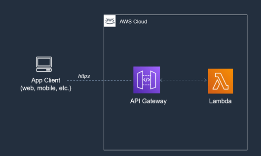
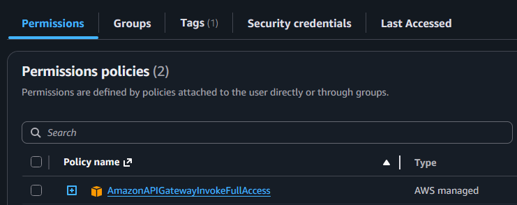
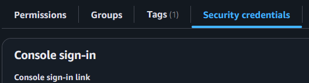
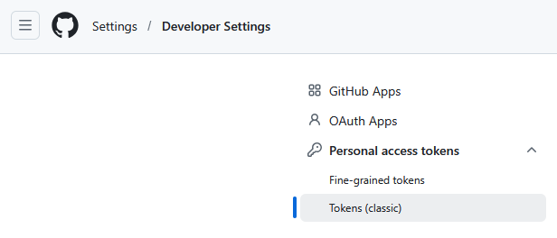
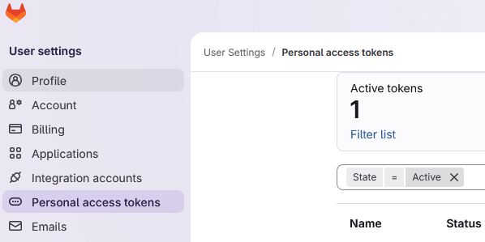
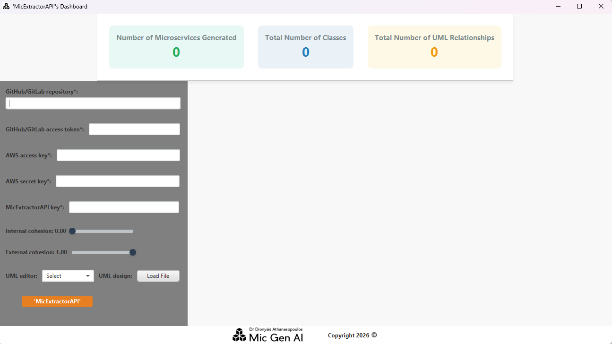
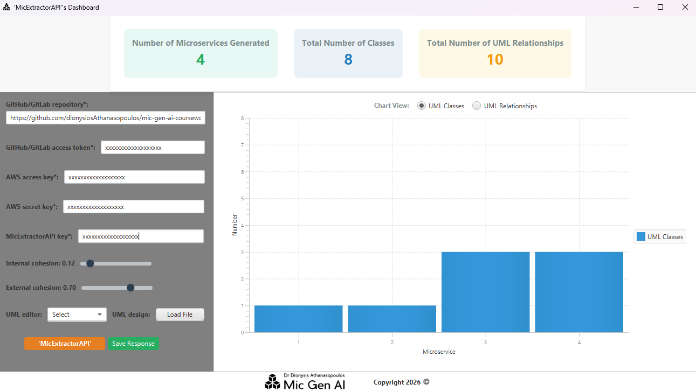
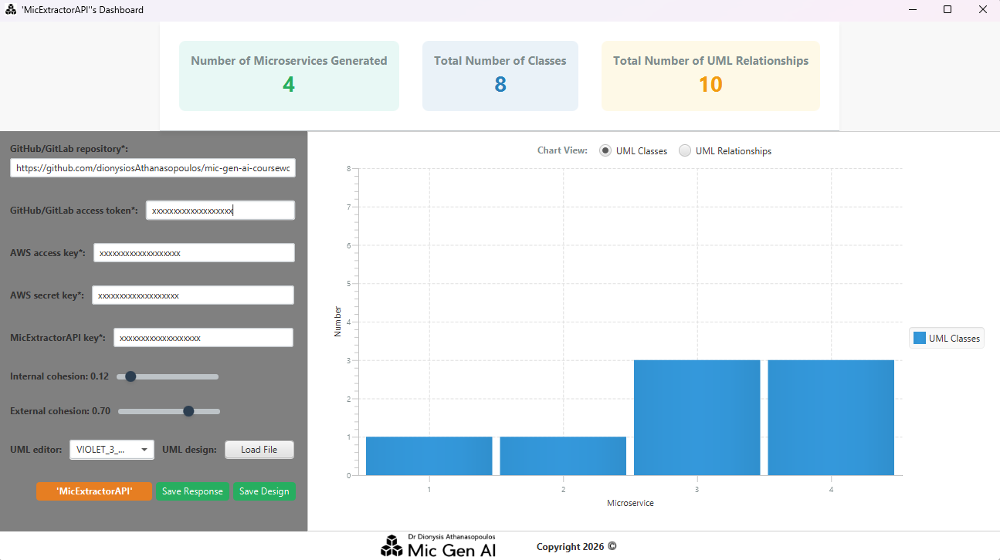
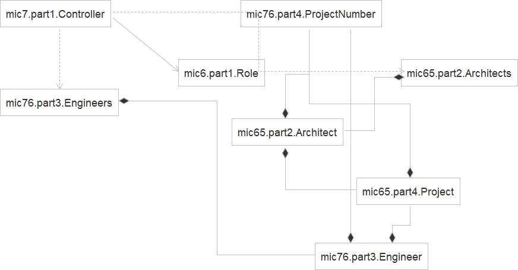
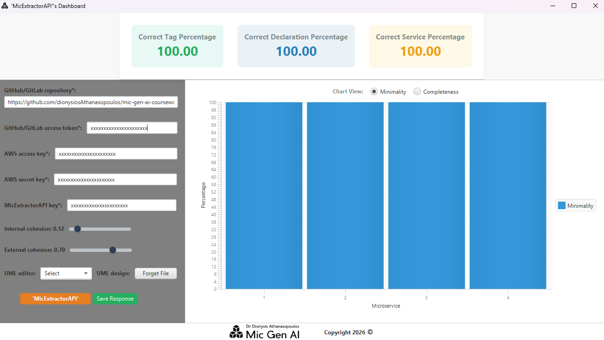

# Dashboard of Analytical AI for UML Microservice Decomposition

<a href="https://www.amazon.com/dp/B0GTG299BW"></a>

This is a **first draft** of the REST API dashboard that provides programmatic access to the Analytical AI of the following <a href="https://www.amazon.com/dp/B0GTG299BW">**handbook**</a>:

- Dr. Dionysis Athanasopoulos, "Analytical AI for UML Microservice Decomposition: Handbook & Automated Classroom Assistant, Amazon, 2026".

This handbook specifies how Analytical AI can be used to do the following:
1. Decompose the Java code of monolithic Java programs to extract microservices;
1. Generate the UML diagram of microservices.


## Table of Content
- [Features](#features)
- [Technologies](#technologies)
- [Installation](#installation)
- [Execution](#execution)
- [Uses](#uses)
- [Disclaimer](#disclaimer)
- [License](#license)

## Features
<a href="https://docs.aws.amazon.com/apigateway/latest/developerguide/welcome.html"></a>

1. **Java programmatic real-time** invocation of the REST 'MicExtractorAPI' in <a href="https://aws.amazon.com/api-gateway">**AWS API Gateway**</a>
    + it calculates <a href="https://docs.aws.amazon.com/AmazonS3/latest/API/sig-v4-header-based-auth.html">AWS signature version 4</a> (authorisation header, transferring payload)
    + you could extract it to reuse it in other applications for making many invocations in an automated way (instead of making an individual invocation at a time using online tools like <a href="https://www.postman.com">postman</a>)
1. **GUI** text fields, combo box, buttons, and sliders to build the input payload of the invocation of the REST 'MicExtractorAPI' in a user-friendly way
1. **Charts** and **KPI** (key performance indicators) cards to visualise the response of the REST 'MicExtractorAPI'
    - it indicatively implements the core part of the UML microservice design metamodel proposed in Chapter 5 of this <a href="https://www.amazon.com/dp/B0GTG299BW">**handbook**</a>
1. **Interactive** chart selection by KPI
1. **Export** of the runtime response of the REST 'MicExtractorAPI' to an XML file.

## Technologies
- **Frontend:** JavaFX, Java 21, Maven, JSON, XML
- **Backend:** AWS API Gateway, AWS Lambda, AWS Serverless Spring Boot 3, Java 21, Maven, JSON, XML
    - the API of the backend can be accessed by the frontend (i.e., the current dashboard) in <a href="https://aws.amazon.com/api-gateway">**AWS API Gateway**</a> only if you have first subscribed to the API via the <a href="https://aws.amazon.com/marketplace">**AWS API Marketplace**</a> (see [Installation](#installation) of the dashboard below)
    - the implementation code of the backend of the API is not open source and its invocations are not free of charge. In contrast, the backend corresponds to a software product that is charged in a pay-as-you-go pricing model (that is, metered usage) delivered on the basis of software as a service (SaaS).
- **Database (or permanent storage in general):** Both the dashboard and 'MicExtractorAPI' do not use any type of permanent storage. Moreover, both	 do not permanently store any personal access token or key.

## Installation
- Clone the GitHub repository ('MicExtractorDashboard'):

```bash
git clone ...
```
- Build the Maven project of the cloned GitHub repository ('MicExtractorDashboard'):

```bash
mvn clean package
```
- Find the REST 'MicExtractorAPI' as a product in AWS marketplace as follows:
    - Go to <a href="https://aws.amazon.com/marketplace">https://aws.amazon.com/marketplace</a>
    - Type in the search bar the product name, 'MicExtractorAPI'
-  You need to subscribe to the usage plan of 'MicExtractorAPI' (otherwise the dashboard will not work)
    - when your subscription request is completed, you will be notified with an API key associated to your subscription to 'MicExtractorAPI'. You must include the API key in the 'x-api-key' header in requests to 'MicExtractorAPI' (see [Execution](#execution) of the dashboard below) because 'MicExtractorAPI' is secured in the AWS API Gateway by using an API key for each subscription
-  You need to activate your AWS IAM authentication for API Gateway REST APIs following these steps:
    - Go to <a href="https://aws.amazon.com/console">https://aws.amazon.com/console</a>
    - IAM → Users → Select your personal user → 
        - Permissions → Add the permission policy 'AmazonAPIGatewayInvokeFullAccess'
        <a href="https://docs.aws.amazon.com/IAM/latest/UserGuide/access_policies_manage-attach-detach.html"></a>
        - Security Credentials → Create Access Key → Choose 'Application running outside AWS' → Generate Access Key (you must include your AWS access key and AWS secret key in the header in requests to 'MicExtractorAPI' (see [Execution](#execution) of the dashboard below) because 'MicExtractorAPI' requires AWS IAM authentication)
        <a href="https://docs.aws.amazon.com/keyspaces/latest/devguide/create.keypair.html"></a>

-  You need to create a personal access token in GitHub/GitLab for being able to use the GitHub/GitLab API (see the screenshots below). The payload of an invocation to 'MicExtractorAPI' must include the URL of a GitHub/GitLab repository to download the source code of the repository (see [Execution](#execution) of the dashboard below).
    - To create a GitHub access token, you can follow the instructions available online at this <a href="https://docs.github.com/en/authentication/keeping-your-account-and-data-secure/managing-your-personal-access-tokens">Web link</a>
    <a href="https://docs.github.com/en/authentication/keeping-your-account-and-data-secure/managing-your-personal-access-tokens"></a>
    - To create a GitLab access token, you can follow the instructions available online at this <a href="https://docs.gitlab.com/user/profile/personal_access_tokens">Web link</a>.
    <a href="https://docs.gitlab.com/user/profile/personal_access_tokens"></a>

## Execution
- Run the frontend (the 'main' method is stored in the '<a href="https://github.com/dionysiosAthanasopoulos/MicExtractorDashboard/blob/master/src/main/java/MicGenAI/MicExtractor/dashboard/MicExtractorDashboardApplication.java">MicExtractorDashboardApplication</a>' class):

```bash
mvn clean compile exec:java
```

- Provide the following information in the text fields, combo box, buttons, and sliders in the screenshot of the dashboard below (the asterisks below indicate what information is compulsory for the execution of 'MicExtractorAPI'):
    - **GitHub/GitLab repository***: the <a href="https://github.com/dionysiosAthanasopoulos/ServiceDecoupler/archive/11543b76419a67cd10df95bb57ef1a2676f30c9f.zip">URL of the ZIP file</a> of a GitHub/GitLab repository or the <a href="https://github.com/dionysiosAthanasopoulos/ServiceDecoupler">URL of a GitHub/GitLab repository</a> ('MicExtractorAPI' retrieves the latest commit among all the branches of the repository).
    - **GitHub/GitLab access token***: it corresponds to the personal access token you acquired from GitHub/GitLab
    - **AWS access key***: corresponds to the AWS access key you acquired from the AWS management console for your AWS IAM authentication to use the AWS API gateway
    - **AWS secret access key***: corresponds to the AWS secret access key you acquired from the AWS management console for your AWS IAM authentication to use the AWS API gateway
    - **MicExtractorAPI key***: corresponds to the API key you acquired from your subscription to 'MicExtractorAPI'
    - **Internal cohesion**: corresponds to the cutoff point (it takes values in the interval [0, 1]) of the internal cohesion of microservice required by the Generative AI to produce cohesive microservices (see the definition of the internal cohesion in Chapter 6 of this <a href="https://www.amazon.com/dp/B0GTG299BW">**handbook**</a>)
    - **External cohesion**: corresponds to the cutoff point (it takes values in the interval [0, 1]) of the external cohesion of microservice required by the Generative AI to produce loosely coupled microservices (see the definition of the external cohesion in Chapter 6 of this <a href="https://www.amazon.com/dp/B0GTG299BW">**handbook**</a>)
    - **UML editor**: corresponds to the UML editor that you will use to visualise the UML class diagram of the microservices generated by 'MicExtractorAPI' (see [Disclaimer](#disclaimer) below regarding UML editors)
    - **UML design**: corresponds to UML microservice design that you can provide to 'MicExtractorAPI' to acquire feedback from 'MicExtractorAPI' on your design. This design must be specified in XML and must follow the metamodel of UML microservice design proposed in Chapter 5 of this <a href="https://www.amazon.com/dp/B0GTG299BW">**handbook**</a>.

<a href="https://docs.aws.amazon.com/apigateway/latest/developerguide/welcome.html"></a>

After hitting the button 'MicExtractorAPI', the dashboard uses the values provided in the fields, 'GitHub/GitLab repository', 'GitHub/GitLab access token', 'Internal cohesion', 'External cohesion', 'UML editor', and 'UML design' to build the JSON payload of the request to the REST 'MicExtractorAPI'.
The syntax of the JSON payload is provided below (if we assume that you had provided information to all the fields of the dashboard):

```yaml
{
    "path" : "...",
    "accessToken" : "...",
    "iscCutoff" : ...,
    "escCutoff" : ...,
    "userDefinedSys" : "...",
    "umlEditor":"VIOLET_3_0_0"
}
```

The Java class <a href="https://github.com/dionysiosAthanasopoulos/MicExtractorDashboard/blob/master/src/main/java/httpClients/AwsHttpPost.java">AwsHttpPost</a> of the dashboard calculates the AWS signature version 4 of the request that will be sent to 'MicExtractorAPI' and finally submits the request to 'MicExtractorAPI'.

## Uses
The use cases of the dashboard are the following:
- If you provide information only to the fields, 'GitHub/GitLab repository', 'GitHub/GitLab access token', 'AWS access key', 'AWS secret key', and 'MicExtractorAPI key' (the default values for the internal and external cohesion cutoff points are 0.0 and 1.0, respectively), then 'MicExtractorAPI' generates the XML specification of the UML design of microservices that follows the UML microservice design metamodel proposed in Chapter 5 of this <a href="https://www.amazon.com/dp/B0GTG299BW">**handbook**</a>. In other words, 'MicExtractorAPI' does not generate a UML design specialised to be editable by a UML editor. The XML specification can be saved in an XML file by hitting the button 'Save Response'. The XML file of the microservices generated in this example is provided in Chapter 8 of this <a href="https://www.amazon.com/dp/B0GTG299BW">**handbook**</a>.



- If you provide information to the fields, 'GitHub/GitLab repository', 'GitHub/GitLab access token', 'AWS access key', 'AWS secret key', 'MicExtractorAPI key', and 'UML editor', then 'MicExtractorAPI' generates the XML specification of the UML design of microservices that follows the UML microservice design metamodel proposed in Chapter 5 of this <a href="https://www.amazon.com/dp/B0GTG299BW">**handbook**</a>. In this case, 'MicExtractorAPI' further generates the UML design specialised to be editable by the UML editor '<a href="https://sourceforge.net/projects/violet/?les/violetumleditor/3.0.0">Violet 3.0.0</a>'. This design can be saved (to be later opened using Violet) by hitting the button 'Save Design'.



We opened the generated UML design using Violet 3.0.0 and a screenshot of the diagram created by Violet 3.0.0 is provided below.



- If you provide information to the fields, 'GitHub/GitLab repository', 'GitHub/GitLab access token', 'AWS access key', 'AWS secret key', 'MicExtractorAPI key', 'UML editor' and 'UML design' (the default values for the internal and external cohesion cutoff points are 0.0 and 1.0, respectively), then 'MicExtractorAPI' generates the XML specification of the feedback on the UML design of your microservices. The value of the field 'UML design' must be the XML file of your microservices that follow the UML design metamodel proposed in Chapter 5 of this <a href="https://www.amazon.com/dp/B0GTG299BW">**handbook**</a>. The feedback can be saved in an XML file by hitting the button 'Save Response'. The XML file of the feedback on the microservices generated in this example is provided in Chapter 8 of this <a href="https://www.amazon.com/dp/B0GTG299BW">**handbook**</a>.



## Disclaimer
- 'MicExtractorAPI' currently processes Java source code that has been stored only in the platforms GitHub and Gitlab. If you provide a URL that does not correspond to a GitHub/Gitlab repository or to a commit of a GitHub/Gitlab repository, then 'MicExtractorAPI' will fail to process your request
    - please note that it does not play any role the type of the project (for example, Maven, etc.) in which the repository stores the Java source code
    - it also does not play any role whether the project contains files in another programming language. 'MicExtractorAPI' processes only the Java files, skipping all the other types of files
    - the current version of 'MicExtractorAPI' processes projects that contain at most 50 Java classes for scalability reasons
- The current version of 'MicExtractorAPI' uses only the open-source UML editor '<a href="https://sourceforge.net/projects/violet/?les/violetumleditor/3.0.0">Violet 3.0.0</a>' to visualise UML class diagrams of microservices.

## License
- <a href="https://www.apache.org/licenses">**Apache 2.0 License**</a>